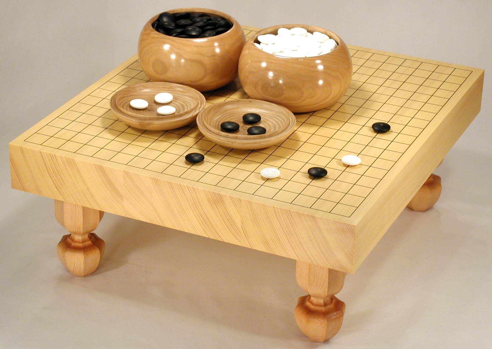
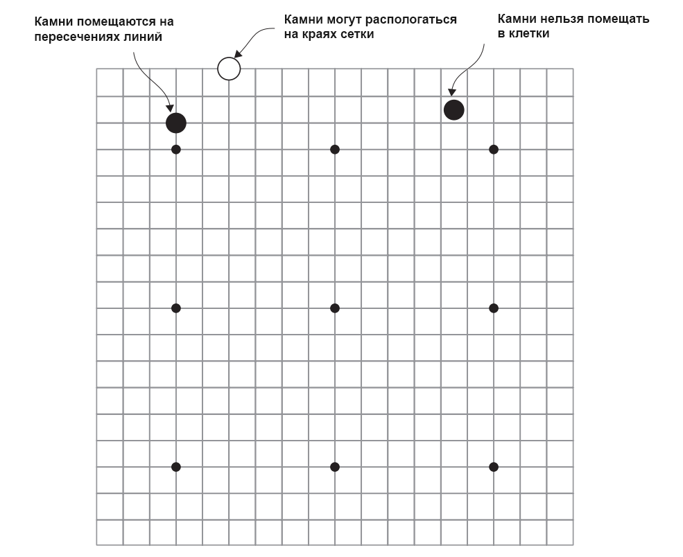

### 1. Основы Игры Го

Два игрока поочередно размещают на доске черные и белые камни, причем начинает игрок черными. Цель состоит в том, чтобы
захватить своими камнями (образно окружить) как можно большую территорию (часть) доски.

#### 1.1 Описание доски

Доска для игры в Го представляет собой квадратную сетку

